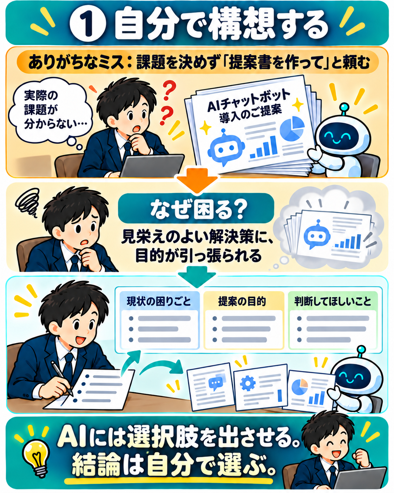
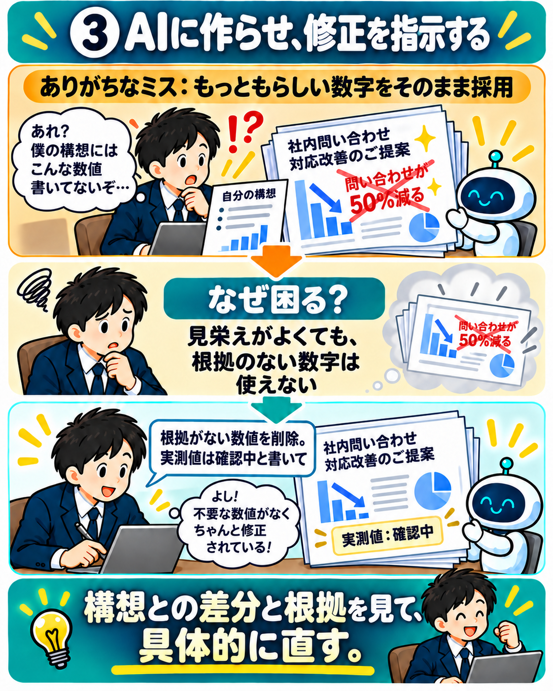
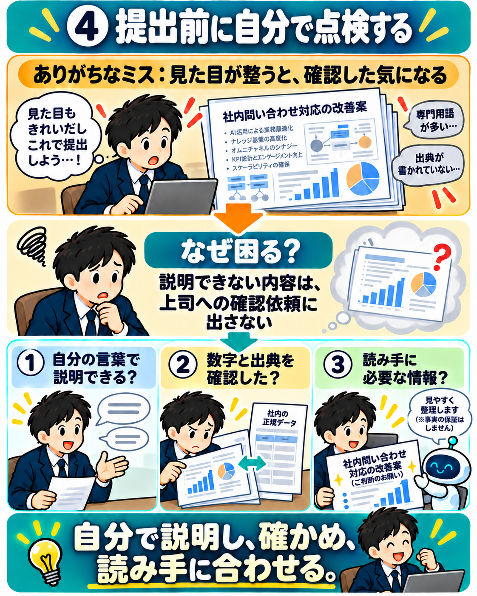

# 前提

ChatGPTにて。

# MCP構築時のpyenvを介したPython導入のメリット


# AI時代における思考の転換方法

プロンプト：
```
AIを使うだけでなく、そのノウハウを周囲のメンバーに共有する事の重要性を説きたい。
加えて、AIを使うことで、雑務や作業を人間がやるのではなく、より上位の思考する業務に軸足を置く事の重要性を説きたい。
イラストでいい感じに表現して。
```


# AIに提案資料を作らせるときの5つのポイント

AIに完成品を丸投げするのではなく、人が目的・方針・根拠を確かめながら段階的に仕上げるための進め方。

## 1. 自分で構想する

課題、提案の目的、判断してほしいことを先に整理し、AIには選択肢を出させる。結論は自分で選ぶ。



## 2. 素案で上司とすり合わせる

完成した大量の資料をいきなり渡さず、まず目的・結論案・相談したい点を示して方針を合意する。


## 3. AIに作らせ、修正を指示する

AIが補った内容をそのまま採用せず、自分の構想との差分と数字の根拠を確認し、具体的に修正する。



## 4. 提出前に自分で点検する

自分の言葉で説明できるか、数字と出典を確認したか、読み手に必要な情報かを提出前に点検する。



## 5. 指摘を理解して直す

指摘の意図をAIに決めつけさせず、自分で論点を考え、必要なら上司に確認したうえで修正する。


# 人材の多角化の重要性

プロンプト：
```
新人に指導する際に、特定の専門分野だけでは組織では生き残りづらいことを説きたい。
技術力だけでなく、コミュケーション力、わかりやすく教えられる能力等、投資における分散投資のような、多角的な人材であるべきだと教えたい。
パズルの例えで、開いた隙間にぴったりハマる人材になるためには多角化が必要なことを教えたいので、いい感じのイラスト生成してほしい。
```

## Standard


## 萌え


## 世紀末


