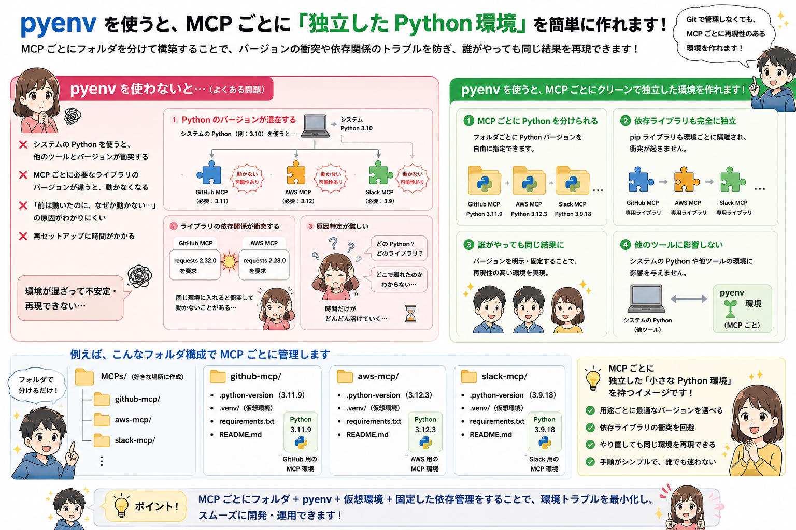

# 前提

ChatGPTにて。

# MCP構築時のpyenvを介したPython導入のメリット



# AI時代における思考の転換方法

プロンプト：
```
AIを使うだけでなく、そのノウハウを周囲のメンバーに共有する事の重要性を説きたい。
加えて、AIを使うことで、雑務や作業を人間がやるのではなく、より上位の思考する業務に軸足を置く事の重要性を説きたい。
イラストでいい感じに表現して。
```


# 人材の多角化の重要性

プロンプト：
```
新人に指導する際に、特定の専門分野だけでは組織では生き残りづらいことを説きたい。
技術力だけでなく、コミュケーション力、わかりやすく教えられる能力等、投資における分散投資のような、多角的な人材であるべきだと教えたい。
パズルの例えで、開いた隙間にぴったりハマる人材になるためには多角化が必要なことを教えたいので、いい感じのイラスト生成してほしい。
```

## Standard


## 萌え


## 世紀末


